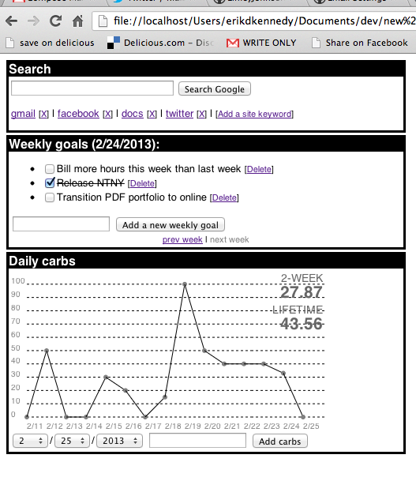

# new-tab-new-you

New Tab New You (NTNY) is a lightweight webpage that displays personal data and goals tracking information every time you open a new tab.

Frequently forcing yourself to look at how you're doing on your goals is a powerful motivator for behavior change.

*New Tab New You in action, tracking weekly goals and diet.*

Right now, there are only two widgets-- weekly goals and carbs tracking.

## Philosophy

I hold that changing your behavior is largely a matter of changing your environment so that it pushes you in the right direction.  That's 100x more effective than willpower alone.

If I want to do pull-ups every day, I shouldn't rely on my willpower to walk to the park across the street every evening-- I should install a pull-up bar in my kitchen.

If I want to eat less junk food, I shouldn't depend on the resolution alone to rocket me to health-- I should make sure I am never even tempted by junk food, removing it from my house and putting out healthy snacks.

Likewise, tracking things like weekly goals and grams of (white or processed) carbs eaten is a good start, but it's only when I am forced to view the information frequently (i.e. every time I open a new tab), that it really becomes a habit.

## Setup

For Chrome:

1. Setting a different new tab screen in Chrome is impossible without an extension-- so first, download the Chrome extension [New Tab Redirect](https://chrome.google.com/webstore/detail/new-tab-redirect/icpgjfneehieebagbmdbhnlpiopdcmna)
2. Download NTNY and put it in a local folder
3. Got to your [Chrome extensions page](chrome://extensions/), select Options under New Tab Redirect, and paste in the local URL to `index.html` in the project

## How it works

NTNY stores all its data in the browser's Local Storage for the localhost.  This means your NTNY page will only work on one computer, and only makes sense to use from one browser.

The chart is a hand-coded HTML5 canvas element-- yeah, D3's gnarly enough for this to be quicker.

And *what's the deal with the Search widget?*, you ask.  Good question.  In Chrome, when you redirect to a different new tab screen, focus does not go to the address bar-- and you can't place it there with JavaScript.  So I implemented a small widget to search Google and go to various common website via keywords.

# Supported browsers

HTML5 Local Storage is supported in the following:

* Chrome 4.0+
* Firefox - 3.5+
* IE - 8.0+
* Safari - 4.0+
* Opera 10.5+

Customizing your new tab screen is supported in the following:

* Chrome - only with the [New Tab Redirect Extension](https://chrome.google.com/webstore/detail/new-tab-redirect/icpgjfneehieebagbmdbhnlpiopdcmna)
* Firefox - ?
* IE - ?
* Safari - ?
* Opera - ?